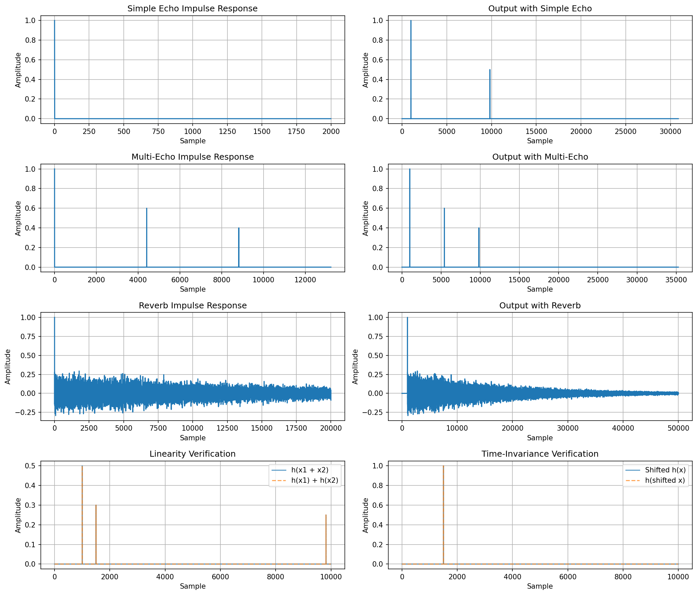

# Convolution-Based Acoustic Reverb Simulator

## Overview

This project implements a convolution-based acoustic reverb simulator that demonstrates how Linear Time-Invariant (LTI) systems model room acoustics. By convolving an input signal with many impulse responses, it is possible to simulate common post processing effects such as echo and reverb, used in music production and audio engineering.

## Theoretical Investigation

### Convolution and LTI Systems

An LTI system can be entirely expressed by its impulse response h(t). The output y(t) for any input x(t) is given by the convolution integral:

```
y(t) = x(t) * h(t) = ∫ x(τ)h(t-τ) dτ
```

In discrete time (for digital systems):

```
y[n] = Σ x[k]h[n-k]
```

We can then predict the response of a signal, given we know how the room will respond to the signal (clap or click).

### LTI Properties

LTI systems are defined by the following properties:

1. **Linearity**: h(x₁ + x₂) = h(x₁) + h(x₂)
   - When two signals are processed together, it's equal to processing them separately and adding the results

2. **Time-Invariance**: If x(t) → y(t), then x(t-τ) → y(t-τ)
   - Delaying the input just delays the output by the same amount; the system doesn't change over time (independent)

## Methodology

### Input Signal

A simple impulse (click) was used as the input signal:

- Sample rate: 44,100 Hz
- Duration: 0.5 seconds
- Signal: A single spike at sample 1000

### Impulse Responses

Three types of impulse responses were created to simulate different acoustic environments:

#### 1. Simple Echo (single wall reflection)

- Direct sound at t=0
- Single reflection at 0.2 seconds (50% amplitude)

#### 2. Multi-Echo (multiple discrete reflections)

- Direct sound at t=0
- First echo at 0.1 seconds (60% amplitude)
- Second echo at 0.2 seconds (40% amplitude)

#### 3. Reverb (concert hall or large room)

- Direct sound at t=0
- Thousands of random reflections over 2 seconds
- Exponentially decaying amplitude

### Convolution Operation

The convolution function is:

```python
output = convolve(input_signal, impulse_response)
```

This implements the discrete convolution sum, computing how each sample of the input is affected by the entire impulse response.

## Results

### Output Characteristics

**Echo Effect**: The original signal followed by one or more distinct delayed copies. The spacing between echoes corresponds to the delay in the impulse response.

**Reverb Effect**: The original signal followed by a dense cloud of reflections that decay over time.

### LTI Verification

#### Linearity Test

- Created two separate input signals (impulses at different times)
- Tested: convolve(x₁ + x₂, h) vs convolve(x₁, h) + convolve(x₂, h)
- Result: Error = ~10⁻¹⁵ (essentially zero, only numerical precision limits)

#### Time-Invariance Test

- Shifted input signal by 500 samples
- Tested: convolve(shifted_input, h) vs shifted_version_of(convolve(input, h))
- Result: Error = ~10⁻¹⁵ (essentially zero)

## Analysis

### How Convolution Produces the Effect

1. **Direct Sound**: The impulse response starts with amplitude 1.0 at t=0, so the original signal passes through unchanged at first

2. **Echoes**: Each additional spike in the impulse response creates a delayed copy of the input signal, scaled by that spike's amplitude

3. **Reverb**: The many small random reflections in the impulse response create a dense tail of sound that decays gradually

### Mathematical Verification

For an echo with delay D and decay α:

```
h[n] = δ[n] + α·δ[n-D]
```

The output is:

```
y[n] = x[n] + α·x[n-D]
```

This is observed in the plots (the original signal plus a scaled, delayed copy).

## Conclusion

Much of the project's difficulties came from the testing phase, ensuring each part of the system was working as expected, in order to iterate further along, as well as the basic understanding of convolution, and verifying the output accurately represents how convolution typically alters signals.

Further work on this project could be focused around a concrete implementation of a audio plugin that is compatible with a DAW (digital audio workstation), particularly in a VST or VST3 format for compatibility across multiple different DAWs (Ableton, FL Studio).

## Visualizations

A plot generated by `matplotlib` for visualizing the effects:



## Audio Output

Two WAV files are generated:

- `output_echo.wav`: Input signal processed with echo effect
- `output_reverb.wav`: Input signal processed with reverb effect
  
## Code Implementation ([GitHub](https://github.com/yousefalfoqaha/convolution-reverb-simulator))

The code below was ran and tested to generate the audio outputs and visualizations.

```python
import numpy as np
import matplotlib.pyplot as plt
from pathlib import Path
from scipy.io import wavfile
from scipy.signal import convolve

sample_rate = 44100
duration = 0.5
t = np.linspace(0, duration, int(sample_rate * duration))

input_signal = np.zeros_like(t)
input_signal[1000] = 1.0


def create_simple_echo(delay_samples, decay):
    impulse_response = np.zeros(delay_samples + 1)
    impulse_response[0] = 1.0
    impulse_response[delay_samples] = decay
    return impulse_response


def create_reverb(decay_time, sample_rate):
    num_samples = int(decay_time * sample_rate)
    impulse_response = np.zeros(num_samples)
    impulse_response[0] = 1.0

    for i in range(1, num_samples):
        impulse_response[i] = np.random.randn() * 0.1 * np.exp(-5 * i / num_samples)

    return impulse_response


ir_echo = create_simple_echo(delay_samples=8820, decay=0.5)
ir_multi_echo = create_simple_echo(4410, 0.6)
temp = np.zeros(13230)
temp[: len(ir_multi_echo)] = ir_multi_echo
temp[8820] = 0.4
ir_multi_echo = temp

ir_reverb = create_reverb(decay_time=2.0, sample_rate=sample_rate)

output_echo = convolve(input_signal, ir_echo, mode="full")
output_multi = convolve(input_signal, ir_multi_echo, mode="full")
output_reverb = convolve(input_signal, ir_reverb, mode="full")

input1 = np.zeros_like(input_signal)
input1[1000] = 0.5
input2 = np.zeros_like(input_signal)
input2[1500] = 0.3

output_sum = convolve(input1 + input2, ir_echo, mode="full")
output1 = convolve(input1, ir_echo, mode="full")
output2 = convolve(input2, ir_echo, mode="full")
sum_of_outputs = output1 + output2

linearity_error = np.max(np.abs(output_sum - sum_of_outputs))
print(f"Linearity test error: {linearity_error:.2e} (should be ~0)")

shift_amount = 500
input_shifted = np.roll(input_signal, shift_amount)
output_original = convolve(input_signal, ir_echo, mode="full")
output_shifted = convolve(input_shifted, ir_echo, mode="full")

time_inv_error = np.max(np.abs(np.roll(output_original, shift_amount) - output_shifted))
print(f"Time-invariance test error: {time_inv_error:.2e} (should be ~0)")

fig, axes = plt.subplots(4, 2, figsize=(14, 12))

axes[0, 0].plot(ir_echo[:2000])
Two WAV files are generated:

axes[0, 0].set_title("Simple Echo Impulse Response")
axes[0, 0].set_xlabel("Sample")
axes[0, 0].set_ylabel("Amplitude")
axes[0, 0].grid(True)

axes[0, 1].plot(output_echo[:50000])
axes[0, 1].set_title("Output with Simple Echo")
axes[0, 1].set_xlabel("Sample")
axes[0, 1].set_ylabel("Amplitude")
axes[0, 1].grid(True)

axes[1, 0].plot(ir_multi_echo[:20000])
axes[1, 0].set_title("Multi-Echo Impulse Response")
axes[1, 0].set_xlabel("Sample")
axes[1, 0].set_ylabel("Amplitude")
axes[1, 0].grid(True)

axes[1, 1].plot(output_multi[:50000])
axes[1, 1].set_title("Output with Multi-Echo")
axes[1, 1].set_xlabel("Sample")
axes[1, 1].set_ylabel("Amplitude")
axes[1, 1].grid(True)

axes[2, 0].plot(ir_reverb[:20000])
axes[2, 0].set_title("Reverb Impulse Response")
axes[2, 0].set_xlabel("Sample")
axes[2, 0].set_ylabel("Amplitude")
axes[2, 0].grid(True)

axes[2, 1].plot(output_reverb[:50000])
axes[2, 1].set_title("Output with Reverb")
axes[2, 1].set_xlabel("Sample")
axes[2, 1].set_ylabel("Amplitude")
axes[2, 1].grid(True)

axes[3, 0].plot(output_sum[:10000], label="h(x1 + x2)", alpha=0.7)
axes[3, 0].plot(sum_of_outputs[:10000], "--", label="h(x1) + h(x2)", alpha=0.7)
axes[3, 0].set_title("Linearity Verification")
axes[3, 0].set_xlabel("Sample")
axes[3, 0].set_ylabel("Amplitude")
axes[3, 0].legend()
axes[3, 0].grid(True)

axes[3, 1].plot(
    np.roll(output_original, shift_amount)[:10000], label="Shifted h(x)", alpha=0.7
)
axes[3, 1].plot(output_shifted[:10000], "--", label="h(shifted x)", alpha=0.7)
axes[3, 1].set_title("Time-Invariance Verification")
axes[3, 1].set_xlabel("Sample")
axes[3, 1].set_ylabel("Amplitude")
axes[3, 1].legend()
axes[3, 1].grid(True)

plt.tight_layout()
plt.savefig("reverb_analysis.png", dpi=150, bbox_inches="tight")
print("\nPlots saved as 'reverb_analysis.png'")
plt.show()


def save_audio(signal, filename, sample_rate):
    normalized = signal / np.max(np.abs(signal))
    audio_int = np.int16(normalized * 32767)
    wavfile.write(filename, sample_rate, audio_int)


save_audio(output_echo, "output_echo.wav", sample_rate)
save_audio(output_reverb, "output_reverb.wav", sample_rate)
print("\nAudio files saved: output_echo.wav, output_reverb.wav")
```
